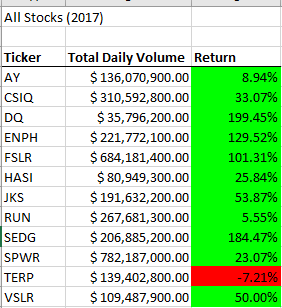
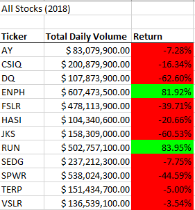
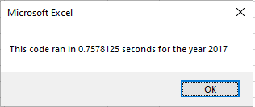
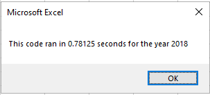
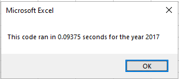
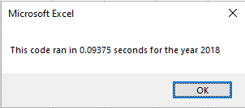

# stock-analysis

# Stock Analysis


## Overview of Project
  The purpose of this project was to help our friend Steve create a more efficient macro for stock analysis that he could use long term. He was pleased with the workbook we collaborated on to help his parents choose between green energy stocks, and wanted to refactor that existing code to be usable for future applications. By refactoring this code, we aimed to create a broader workbook that can be used quickly and efficiently on potentially huge numbers of stocks with large underlying trading datasets.

## Analysis

  We were able to help Steve and by extention his parents make an educated decision on their green energy stocks, even using our initial macro before refactoring it. There were huge gains seen in 2017, followed by a large drop off in 2018 with returns falling for all but two of the 12 stocks chosen to analyze. Here we can see the results across the two years of stock data based on the results of our macro compiling the data into easy-to-read tables.

#### Table 1: 2017 Results


#### Table 2: 2018 Results



## VBA Results
  In terms of code performance and functionality, there were great improvements, regardless of the poor performance of the stocks in question. 
  
  Firstly, we added an important feature that allowed for Steve or other end users to input the desired year that they wanted to run analysis on. Initially, the VBA code was hardcoded to use "2018" as the year, and in order to change which year of data was looked at, one would have to go in and edit the code.

```
      yearValue = InputBox("What year would you like to run the analysis on?")

    startTime = Timer
    
    'Format the output sheet on All Stocks Analysis worksheet
    Worksheets("All Stocks Analysis").Activate
    
    Range("A1").Value = "All Stocks (" + yearValue + ")"
```    
```  
    'Activate data worksheet
    Worksheets(yearValue).Activate
```
    
   
   Here instead, we created an input box which saves the user input as a variable, and uses that to determine which worksheet to activate before running the calculation portions of the code. Other formatting such as titles is also updated accordingly. Now, this technically looks at the spreadsheet names, but in the current format they are named after years, so to an end user they function the same.
   
   As for performance, we made a huge functional change to allow for this code to potentially tackle much larger datasets in the future. In both cases, the ticker symbols we want to take a look at are put into an array. The key difference is using a tickerIndex to iterate through the array, vs looping through the entire dataset for each ticker symbol one at a time.
   The difference is easier to see here:
   
   #### First Code:
```
    '4) Loop through tickers
    For i = 0 To 11
        ticker = tickers(i)
        totalVolume = 0
        '5) loop through rows in the data
        Worksheets(yearValue).Activate
        For j = 2 To RowCount
```
   Here in the first pass of code, the outer loop loops through the different ticker options, then the inner loop looks at every row of data to match to the ticker option you are on.
   
  #### Refactored Code:
```
   tickerIndex = 0

    '1b) Create three output arrays
    Dim tickerVolumes(12) As Long
    Dim tickerStartingPrices(12) As Single
    Dim tickerEndingPrices(12) As Single
    
    ''2a) Create a for loop to initialize the tickerVolumes to zero.
    For i = 0 To 11
        tickerVolumes(i) = 0
    Next i
        
    ''2b) Loop over all the rows in the spreadsheet.
    For i = 2 To RowCount
    
        '3a) Increase volume for current ticker
        tickerVolumes(tickerIndex) = tickerVolumes(tickerIndex) + Cells(i, 8).Value
```

    In this refactored code, a tickerIndex is used outside of the loop through the data, and it is iterated upon once the current row ticker symbol does not match the next row ticker symbol. This allows us to keep track of the running totals for each stock as we go, rather than looping through the entire dataset for one stock, adding it up, then starting from the beginning of the data for the next stock.
    
    As you would expect, running through the whole dataset one time rather than once per stock or 12 times greatly improves performance as seen in these screenshots of before and after processing times:
    
    #### Before Refactoring Processing Times
    
    
    
    
    
    #### After Refactoring Processing Times
    
    
    
    


The analysis is well described with screenshots and code (4 pt).
Summary
There is a detailed statement on the advantages and disadvantages of refactoring code in general (3 pt).
There is a detailed statement on the advantages and disadvantages of the original and refactored VBA script (3 pt).
